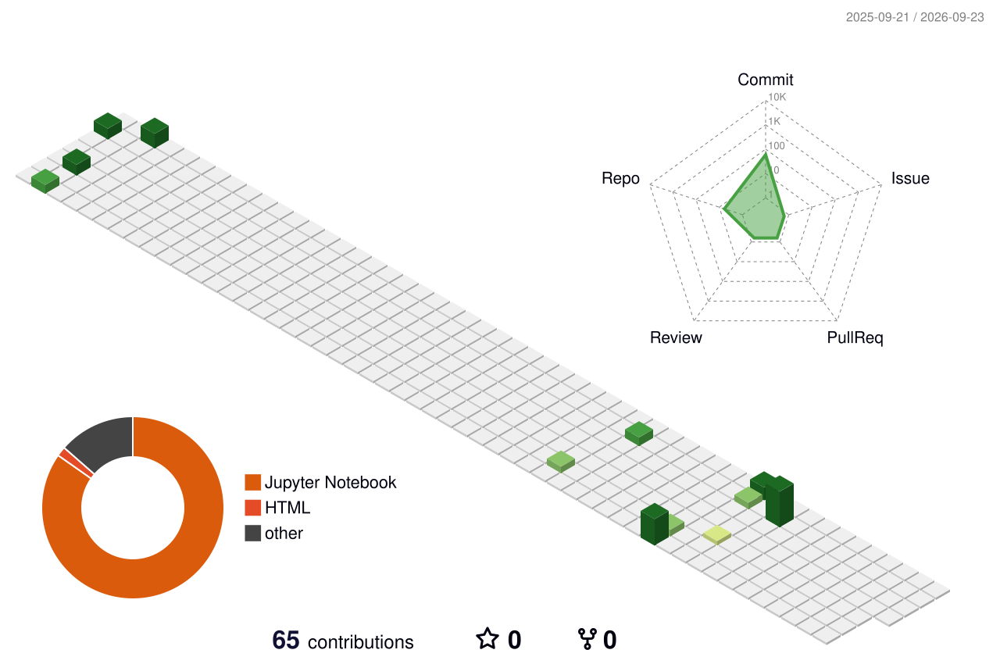

 

 

## 👩‍💻 About Me

I'm an AI/ML undergraduate (B.Tech, Artificial Intelligence & Machine Learning, graduating **2027**) who combines **machine learning**, **Generative AI**, and **data analytics** to build practical, data-driven applications. My work spans fine-tuning language models for data augmentation, building CNN-based diagnostic tools, and turning raw datasets into decision-ready dashboards.

- 🎓 B.Tech in AI & ML — KLM College of Engineering for Women (2023–2027)
- 🔭 Currently strengthening skills in Generative AI, RAG systems, and applied data analytics
- 🌱 Background in internships and an industry externship focused on AI and data analysis
- 🎯 Looking for **internships and entry-level roles** in AI/ML, Generative AI, and Data Analytics
- 💬 Ask me about Python, Scikit-learn, LLMs, Power BI, or building end-to-end ML pipelines

 

## 🧠 Tech Stack

**AI / Machine Learning**

**Generative AI**

**Data Analytics**

**Development / Tools**

 

## 🚀 Featured Projects

<table>
<tr>
<td width="50%" valign="top">

### 📧 Email Spam Classification using Generative AI
*Global Next Consulting — AI/ML Internship Project*

Fine-tuned **GPT-2** to generate synthetic spam/ham emails, expanding the training dataset from 81K to **88K samples** to correct class imbalance. Achieved **97.95% accuracy** and **97.97% precision** with an SVC classifier by integrating the augmented data into the training pipeline. Validated synthetic data quality using **Chi-Square** and **KS tests**, and deployed a real-time **Streamlit** web app.

`Generative AI` `NLP` `Python` `Hugging Face Transformers` `Streamlit`

🔗 [Live Demo](https://gncipl-internship-major-project-generate-email-text-for-spam-c.streamlit.app)

</td>
<td width="50%" valign="top">

### 🌾 KrishiSetu AI — Crop Disease Diagnosis
*Gen AI Academy APAC Hackathon*

Built a **CNN**-based system classifying **38 plant diseases** from leaf images, with live camera and batch prediction support. Integrated the **Gemini API** to generate multilingual treatment plans, and built a **RAG** chatbot on a verified agricultural knowledge base using **PostgreSQL** and **pgvector**.

`TensorFlow` `Keras` `CNN` `Gemini API` `RAG` `pgvector` `Streamlit` `OpenCV`

🔗 [Live Demo](https://plantdiseasedetectionai.streamlit.app)

</td>
</tr>
<tr>
<td width="50%" valign="top">

### 🎵 Spotify Analytics Dashboard
*Power BI Project*

Built an interactive **Power BI** dashboard analyzing artist performance, song popularity, album trends, and listening patterns. Applied data cleaning and **DAX** measures to design visualizations for monthly popularity trends, explicit vs. non-explicit songs, and top artists/tracks with interactive filters.

`Power BI` `DAX` `Data Cleaning` `Data Visualization` `Dashboard Design`

</td>
<td width="50%" valign="top">

### 📊 Securitisation Data Analysis
*Zetheta Algorithms Private Limited — Data Analyst Externship*

Performed hands-on data analysis on securitisation data over a 15-day full-time-equivalent externship. Assessed data accuracy, flagged anomalies, and structured findings into clear documentation for knowledge sharing across the team.

`Data Analysis` `Data Assessment` `MS Excel` `Documentation`

</td>
</tr>
</table>

 

## 💼 Experience

| Role | Organization | Duration |
|---|---|---|
| Data Analyst — Externship | Zetheta Algorithms Private Limited | Jul 2026 · 15 full-time-equivalent days |
| AI/ML Intern | Global Next Consulting India Pvt. Ltd. (GNCIPL) | Oct 2025 · 6 weeks, Remote |
| Google Cloud Generative AI Intern | SmartBridge Educational Services (with APSCHE) | Mar 2025 – Sep 2025 · 6 months, Remote |

 

## 📜 Certifications

- Google Cloud Generative AI Program — in collaboration with APSCHE
- Deloitte Data Analytics Job Simulation — Forage
- Responsive Web Design Certification — freeCodeCamp

## 🏆 Achievements

- 🥇 Winner — College-Level Hackathon, KLMCEW (2025)
- 🥇 First Prize — ISRO Space India 2024 (College Level)
- 🎨 Graphic Designer & Photoshop Editor — College Media Team (2023–2024)

 

## 📊 GitHub Analytics

 

 

## 🐍 Contribution Snake

<picture>
  <source media="(prefers-color-scheme: dark)" srcset="https://raw.githubusercontent.com/thvarsha00/thvarsha00/output/assets/snake-dark.svg" />
  <source media="(prefers-color-scheme: light)" srcset="https://raw.githubusercontent.com/thvarsha00/thvarsha00/output/assets/snake.svg" />
  
</picture>

 

## 🌐 3D Contribution Calendar

<picture>
  <source media="(prefers-color-scheme: dark)" srcset="./profile-3d-contrib/profile-night-green.svg" />
  <source media="(prefers-color-scheme: light)" srcset="./profile-3d-contrib/profile-green.svg" />
  
</picture>

 

## 📫 Let's Connect

 

